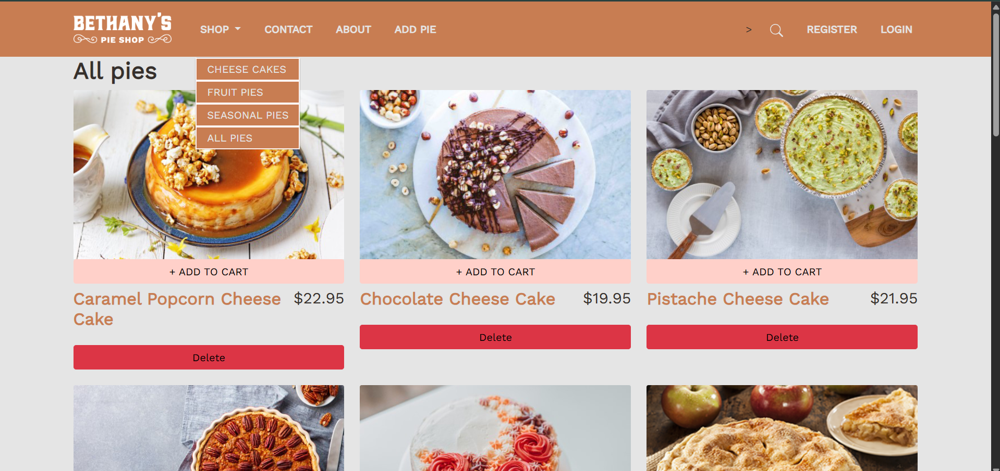
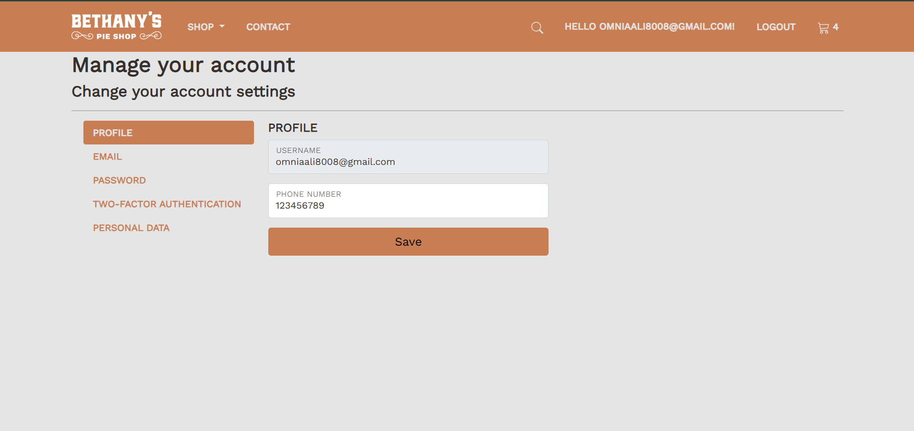
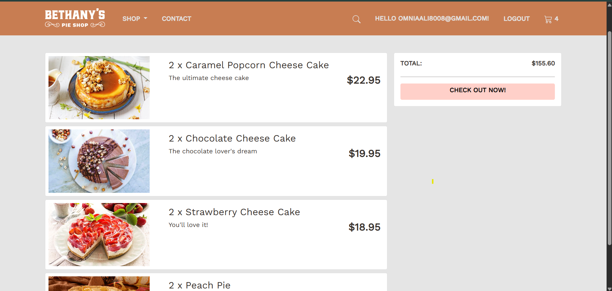
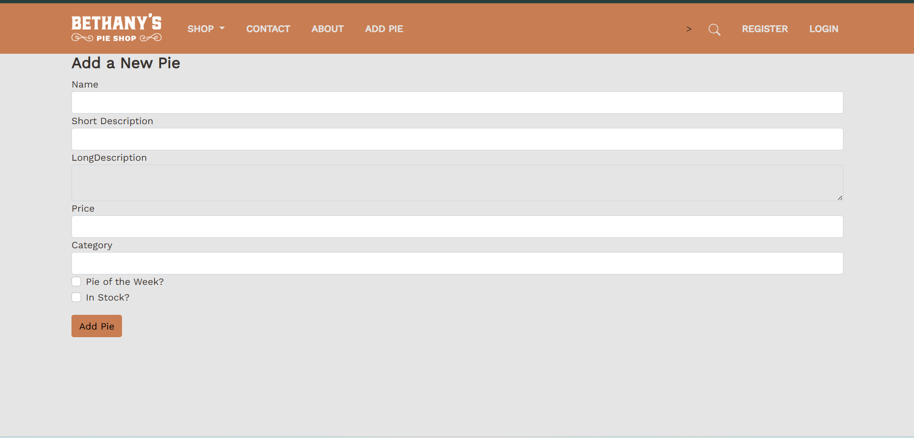

# Bethany's Pie Shop

An ASP.NET Core MVC e-commerce application for managing and displaying pie products.

## 🚀 Features
- Product listing
- Category filtering
- Database seeding
- Entity Framework Core integration
- SQL Server database

## 🛠 Technologies
- ASP.NET Core
- Entity Framework Core
- SQL Server
- Razor Views
### 🗂 Categories

## 🗄 Database Setup

Update the connection string in appsettings.json:

Server=YOUR_SERVER_NAME;Database=BethanysPieShop;Trusted_Connection=True;

Then run:

Update-Database

## 📌 Author
Omnia Ali
